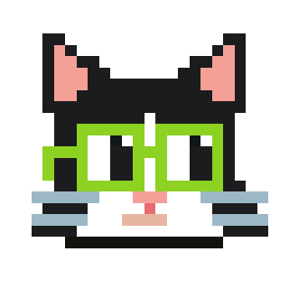

# Plutocats
Plutocats is an onchain club for crypto enthusiasts. Inspired by Nouns, Plutocats
takes some of its best ideas like onchain art and iterates on others to create a
foundation for a stable community.

This initial release of Plutocats is considered functionally complete, however,
future contributions are planned to guide the community (if they choose to do so) through stages 2 and 3 listed below:

1) `Current stage`: Onchain avatar community and capital formation that earns Blast native yield. (staking w/ friends)
2) Fair distribution of governance rights to community members.
3) DAO formation and onchain governance of yield earned through membership sales.

For a deep dive on Plutocats visit the [official website](https://plutocats.wtf/)
or read this [introductory blog post](https://mirror.xyz/tm0b1l.eth/URgZgA36Hhceg34yXbBOuwwcBRzV_416QATHX1pFu3k).

# Getting started
This monorepo does not use build tools like lerna. Each package contains a README 
with steps to prepare and run the code. You'll need tools like [Node.js](https://nodejs.org/en/download), [pnpm](https://pnpm.io/installation), and [Foundry](https://book.getfoundry.sh/getting-started/installation) installed to get started.

# Packages
## Art
Plutocats art assets and RLE encoded image data.

## Contracts
Plutocats smart contracts.

## Web
Plutocats [official website](https://plutocats.wtf/).